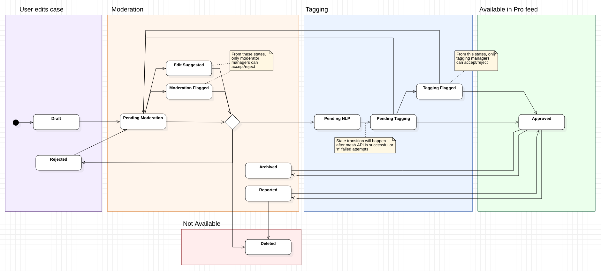

# Content Model

This document provides an overview of the database design for cases and content.  

## Case

**c_case**:  The base unit of representation for authored data on the figure1 platform.  In particular a case contains 
one or more `c_content` which encapsulates the information presented by the case.

Tactics created by the admin tool, and cases created by users in the app are distinguished by different values for 
`state`.  All tactic states are prefixed by `sc_`, while user created cases have no prefix.  

User created cases use the `state` values and transitions shown below:

## Content

**c_content**: Contains information data for a case, for example the title and case description.  The main goal of
content is to represent data on a case which can exist in a one to many relationship.  An individual `c_content` row
represents either a portion of the data for a case (for example, a single slide within a Clinical Moments case), or the
entirety of the case data (for example, a standard image case).  

## Optional Content Data

**c_content_extension**: Contains optional data for a content which is only applicable to certain content items.  For
example, quizzes contain a value for `question` and `question_answer_details`, and quiz series contain a `heading`.

**c_content_update**: Additional information submitted by a user to augment the data in a content after it was created.
Content updates support an update_type which describes the type of update: it can be a diagnosis for the case (either
added on creation or at a later time) or just a regular text update.

**c_features**: Describes the behaviour and allowed actions on a content.  For example, if a case allows comments to be
added.

**c_media**: The non-text media associated with a content.  This may be an image, image series or video.

**c_sponsored_content**: Contains sponsor-related information for a piece of content.  Only present if the content is
sponsored; if missing, the content is not sponsored.

## Comments

**c_comments**: The user submitted discussions for a piece of content.  These are stored in a tree structured based on 
the `path` column.  Comments may be reported for moderation by entries in the `c_comment_report` table.

## Case Quizzes:

Case quizzes and polls use `c_question_option` and `c_question_vote`.  They are associated with a specific content_uuid
and the functionality is fairly limited, supporting a single answer per content.

**c_question_option**: If a content contains a quiz or poll question, there will be multiple `c_question_option` 
associated with it to represent the possible choices the user can select.  If no options for a particular `content_uuid`
is marked with `is_answer=True` then the question is considered a poll instead of a quiz.

**c_question_vote**: User answer for a quiz or poll question. 

## Case CME Questions:

Case CME questions use `c_question`, `c_question_answer_option`, `c_answer_group` and `c_case_cme_user_answer`.  Unlike 
the case quiz tables these questions are not associated with a specific case.  The models are also more complex 
supporting a variety of answer types (e.g. checkbox, radio buttons, freeform) and branching logic within a series of 
questions.

## Mesh Terms

The Medical Subject Headings (MeSH) terms associated with a case used for classification.

**c_mesh_terms**:  Deprecated table, containing old MeSH data collected from [MeSH On Demand](https://www.nlm.nih.gov/oet/ed/mesh/meshondemand.html)

**c_case_mesh_terms**:  Currently used table for storing MeSH data for cases.

## Publications

**c_publications**: The academic publications (aka scientific literature) associated with a case.

## Examples

  - [Single quiz case](../images/ContentExampleQuiz.png)
  - [Quiz series case](../images/ContentExampleQuizSeries.png)
