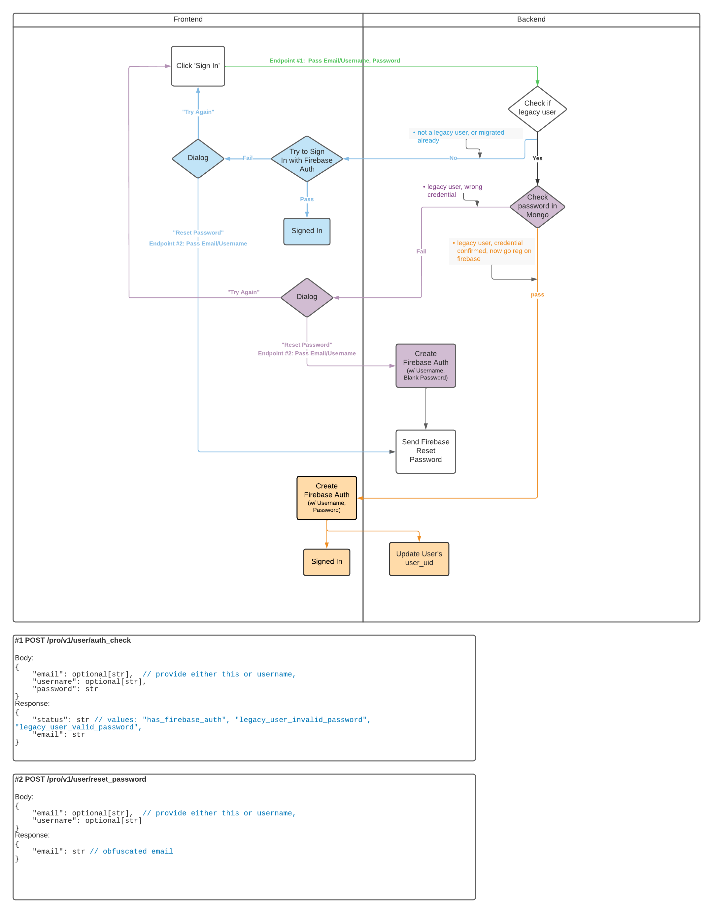

# Login Flow

User login in Pro needs to account for users who previously had a figure 1 account in Legacy but have not yet signed up
in Pro.  These users do not yet have a firebase auth record and clients would incorrectly receive 'no user found' if
the credentials were directly validated in firebase auth.  Instead all logins are first checked by the backend to see
if they are a legacy user who is logging in for the first time (i.e. no `user_uid`).  

For these users we need to verify their login credentials against their legacy hash instead of through firebase auth.
If valid we create a firebase auth record with these credentials to use going forward, if invalid they are offered a 
path using reset password.  

The diagram below shows the flow the clients use to handle login and the backend endpoints used.

### Diagram

